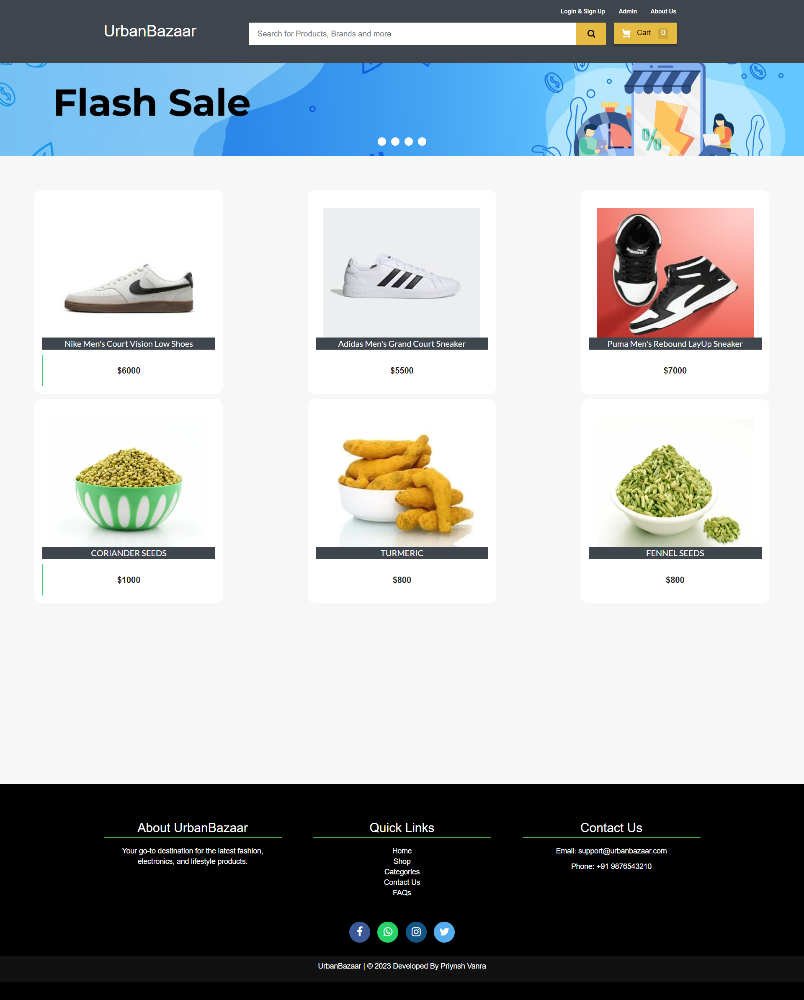

# UrbanBazzar 🛒

UrbanBazzar is an e-commerce platform offering a variety of products, including fashion, electronics, and lifestyle essentials.


## 🚀 Features
- **User Authentication**: Login & Signup functionality.
- **Product Catalog**: Browse and search for products.
- **Shopping Cart**: Add and remove items easily.
- **Admin Panel**: Manage products and orders.
- **Responsive Design**: Works on mobile, tablet, and desktop.

## 🛠️ Tech Stack
- **Frontend**: HTML, CSS, JavaScript
- **Backend**: Django (Python)
- **Database**: SQLite / MySQL
- **Payment Gateway**: Razorpay Integration

## 📸 Screenshots
### Homepage
.png)

## 📌 Installation Guide
1. **Clone the repository**  
   ```sh
   git clone https://github.com/priynsh028/UrbanBazzar.git
   cd UrbanBazzar
2. Create a virtual environment (optional but recommended)
3. Install dependencies
4. Run migrations
5. Start the server

📌 Developed By: Priynsh Vanra
📝 © 2025 UrbanBazzar
